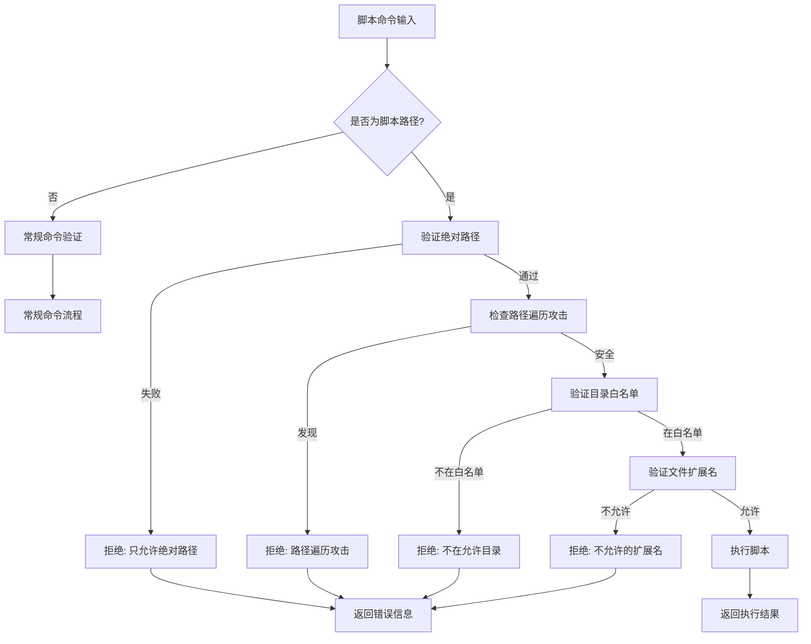

# OPS系统脚本安全执行文档

## 概述

OPS系统提供了安全的脚本执行功能，允许在指定的白名单目录中运行预定义的脚本。系统通过多层安全验证机制，确保只有安全的脚本能够被执行，防止恶意脚本和路径遍历攻击。

## 安全特性

### 🔒 目录白名单控制

系统只允许执行位于预定义白名单目录中的脚本：

**默认允许的脚本目录：**
- `/opt/ops-scripts` - 生产运维脚本目录
- `/usr/local/bin/scripts` - 本地脚本目录
- `/home/ops/scripts` - ops用户脚本目录
- `/tmp/ops-scripts` - 测试脚本目录（仅用于测试）

### 🔒 文件扩展名验证

系统只允许执行特定扩展名的脚本文件：

**允许的脚本扩展名：**
- `.sh` - Shell脚本
- `.py` - Python脚本
- `.pl` - Perl脚本
- `.rb` - Ruby脚本

**拒绝的危险扩展名：**
- `.exe`, `.bat`, `.com` - 可执行文件
- `.bin`, `.run` - 二进制文件
- 其他未明确允许的扩展名

### 🔒 路径安全验证

系统对脚本路径进行严格的安全检查：

1. **绝对路径要求** - 只允许绝对路径脚本
2. **路径遍历防护** - 阻止 `../`、`./` 等路径遍历字符
3. **相对路径拒绝** - 拒绝相对路径脚本
4. **路径规范化** - 防止路径操纵攻击

## 配置方法

### 方法1：环境变量配置

```bash
# 设置允许的脚本目录（逗号分隔）
export OPS_ALLOWED_SCRIPT_DIRS="/opt/scripts,/usr/local/scripts,/home/admin/scripts"

# 设置允许的脚本扩展名（逗号分隔）
export OPS_ALLOWED_SCRIPT_EXTENSIONS="sh,py,pl,rb,js"

# 启动服务端
cargo run --bin ops-server
```

### 方法2：配置文件

创建服务端配置文件 `server-config.toml`：

```toml
# 服务端基础配置
tcp_bind_addr = "0.0.0.0"
tcp_port = 12345
http_bind_addr = "0.0.0.0"
http_port = 3000

# 脚本安全配置
allowed_script_dirs = [
    "/opt/ops-scripts",
    "/usr/local/bin/scripts", 
    "/home/ops/scripts",
    "/data/automation-scripts"
]

allowed_script_extensions = ["sh", "py", "pl", "rb", "js"]

# 其他配置...
cleanup_interval_secs = 60
client_timeout_secs = 300
max_connections = 1000
```

使用配置文件启动：

```bash
cargo run --bin ops-server -- --config server-config.toml
```

## 使用方法

### 前端Web界面使用

1. **选择预定义脚本**
   - 在命令执行区域选择"预定义命令"
   - 从类别筛选中选择"脚本执行"
   - 选择要执行的脚本
   - 查看脚本描述和执行说明

2. **自定义脚本输入**
   - 选择"自定义命令"模式
   - 输入脚本的完整绝对路径
   - 系统会实时进行安全验证
   - 危险脚本会被自动拒绝

### API接口使用

**发送脚本执行命令：**

```bash
curl -X POST -H "Content-Type: application/json" \
  -d '{
    "client_id": "client-uuid",
    "command": "/opt/ops-scripts/health-check.sh"
  }' \
  http://localhost:3000/api/send-command
```

**获取预定义命令列表（包含脚本）：**

```bash
curl -X GET http://localhost:3000/api/predefined-commands
```

## 脚本示例

### 系统健康检查脚本

创建 `/opt/ops-scripts/health-check.sh`：

```bash
#!/bin/bash

echo "=== 系统健康检查报告 ==="
echo "检查时间: $(date)"
echo ""

echo "== 系统负载 =="
uptime

echo ""
echo "== 内存使用 =="
free -h

echo ""
echo "== 磁盘空间 =="
df -h | head -5

echo ""
echo "== 网络连接 =="
netstat -tn | grep ESTABLISHED | wc -l | xargs echo "活跃连接数:"

echo ""
echo "=== 检查完成 ==="
```

### 磁盘使用分析脚本

创建 `/opt/ops-scripts/disk-usage.py`：

```python
#!/usr/bin/env python3

import os
import shutil

def get_disk_usage():
    """获取磁盘使用情况"""
    print("=== 磁盘使用情况分析 ===")
    print(f"检查时间: {os.popen('date').read().strip()}")
    print()
    
    # 获取根目录磁盘使用情况
    total, used, free = shutil.disk_usage("/")
    
    print("== 根目录磁盘统计 ==")
    print(f"总空间: {total // (1024**3):.1f} GB")
    print(f"已使用: {used // (1024**3):.1f} GB")
    print(f"可用空间: {free // (1024**3):.1f} GB")
    print(f"使用率: {(used / total * 100):.1f}%")
    
    print()
    print("== 目录大小排序 (前5) ==")
    os.system("du -sh /var/log /tmp /home /usr /opt 2>/dev/null | sort -hr | head -5")

if __name__ == "__main__":
    get_disk_usage()
```

## 安全验证流程



## 错误信息说明

### 常见安全拒绝原因

1. **"只允许执行绝对路径的脚本"**
   - 原因：使用了相对路径
   - 解决：使用完整的绝对路径，如 `/opt/ops-scripts/script.sh`

2. **"脚本路径包含危险的路径遍历字符"**
   - 原因：路径中包含 `../` 或 `./`
   - 解决：使用干净的绝对路径，不包含路径遍历字符

3. **"脚本不在允许的目录中"**
   - 原因：脚本不在配置的白名单目录内
   - 解决：将脚本移动到允许的目录，或更新配置添加目录

4. **"不允许的脚本类型"**
   - 原因：文件扩展名不在允许列表中
   - 解决：重命名文件使用允许的扩展名，或更新配置

5. **"脚本文件必须有扩展名"**
   - 原因：脚本文件没有扩展名
   - 解决：为脚本文件添加适当的扩展名

## 测试脚本安全性

### 创建测试脚本

```bash
# 创建测试目录和脚本
sudo mkdir -p /opt/ops-scripts
sudo chmod 755 /opt/ops-scripts

# 创建测试脚本
sudo tee /opt/ops-scripts/test-script.sh << 'EOF'
#!/bin/bash
echo "测试脚本执行成功!"
echo "当前时间: $(date)"
echo "当前用户: $(whoami)"
EOF

sudo chmod +x /opt/ops-scripts/test-script.sh
```

### 安全测试用例

```bash
# 1. 测试允许的脚本（应该成功）
curl -X POST -H "Content-Type: application/json" \
  -d '{"client_id":"your-client-id","command":"/opt/ops-scripts/test-script.sh"}' \
  http://localhost:3000/api/send-command

# 2. 测试路径遍历攻击（应该被拒绝）
curl -X POST -H "Content-Type: application/json" \
  -d '{"client_id":"your-client-id","command":"/opt/ops-scripts/../../../etc/passwd"}' \
  http://localhost:3000/api/send-command

# 3. 测试不在白名单的目录（应该被拒绝）
curl -X POST -H "Content-Type: application/json" \
  -d '{"client_id":"your-client-id","command":"/tmp/dangerous-script.sh"}' \
  http://localhost:3000/api/send-command

# 4. 测试不允许的扩展名（应该被拒绝）
curl -X POST -H "Content-Type: application/json" \
  -d '{"client_id":"your-client-id","command":"/opt/ops-scripts/script.exe"}' \
  http://localhost:3000/api/send-command
```

## 最佳实践

### 脚本开发建议

1. **使用标准shebang**
   ```bash
   #!/bin/bash
   #!/usr/bin/env python3
   #!/usr/bin/env ruby
   ```

2. **添加错误处理**
   ```bash
   #!/bin/bash
   set -euo pipefail  # 严格错误处理
   ```

3. **提供详细输出**
   ```bash
   echo "开始执行任务..."
   echo "任务进度: 50%"
   echo "任务完成!"
   ```

4. **使用标准退出码**
   ```bash
   exit 0  # 成功
   exit 1  # 一般错误
   exit 2  # 参数错误
   ```

### 安全建议

1. **定期审核脚本**
   - 定期检查脚本目录中的文件
   - 移除不再需要的脚本
   - 更新过时的脚本逻辑

2. **最小权限原则**
   - 脚本只执行必要的操作
   - 避免使用sudo或root权限
   - 限制文件和网络访问

3. **日志记录**
   - 脚本执行会自动记录到系统日志
   - 重要操作添加详细日志
   - 监控异常执行情况

4. **版本控制**
   - 使用Git管理脚本版本
   - 记录脚本变更历史
   - 实施代码审查流程

## 故障排除

### 常见问题

**Q: 为什么我的脚本无法执行？**

A: 请检查以下几点：
1. 脚本是否在允许的目录中
2. 文件是否有正确的扩展名
3. 路径是否为绝对路径
4. 脚本是否有执行权限

**Q: 如何添加新的脚本目录？**

A: 更新服务端配置：
```bash
export OPS_ALLOWED_SCRIPT_DIRS="/opt/ops-scripts,/your/new/directory"
```
或在配置文件中添加新目录，然后重启服务端。

**Q: 脚本执行超时怎么办？**

A: 检查脚本逻辑，确保：
1. 没有无限循环
2. 外部命令有超时设置
3. 脚本执行时间合理

**Q: 如何查看脚本执行日志？**

A: 查看客户端和服务端日志：
```bash
# 客户端日志
RUST_LOG=debug cargo run --bin ops-client

# 服务端日志
RUST_LOG=debug cargo run --bin ops-server
```

## 总结

OPS系统的脚本安全执行功能提供了强大而安全的自动化能力。通过严格的目录白名单、文件扩展名验证和路径安全检查，确保只有经过授权的脚本能够被执行，有效防止恶意代码执行和安全漏洞。

合理使用此功能可以大大提高运维效率，同时保持系统的安全性和稳定性。